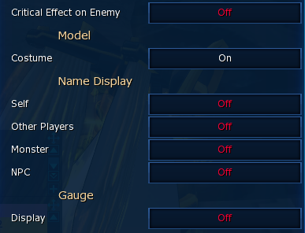
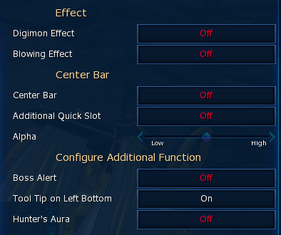
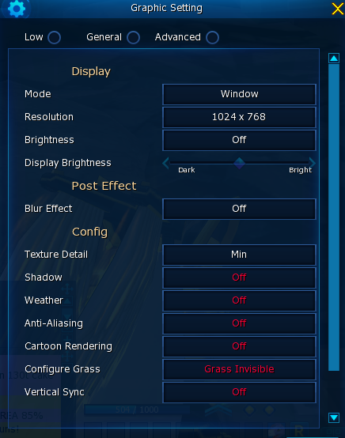

# 新手指引
> Date: 2023.7.2
>
> Author: Immortal.S

- [新手指引](#新手指引)
  - [下载安装](#下载安装)
    - [官网](#官网)
    - [群文件](#群文件)
    - [官网账号注册](#官网账号注册)
    - [登录端介绍](#登录端介绍)
  - [游戏内容](#游戏内容)
    - [角色创建](#角色创建)
    - [常用设置](#常用设置)
    - [人物系统](#人物系统)
      - [基础服饰](#基础服饰)
      - [首饰系统](#首饰系统)
      - [数码光环](#数码光环)
      - [合体晶片](#合体晶片)
      - [X进化暴龙机](#x进化暴龙机)
      - [数码暴龙机](#数码暴龙机)
      - [领域晶卡](#领域晶卡)
    - [宠物系统](#宠物系统)
      - [孵蛋](#孵蛋)
      - [练级](#练级)
      - [进化](#进化)
        - [究极进化](#究极进化)
        - [合体进化](#合体进化)
        - [X进化](#x进化)
      - [强化](#强化)
      - [超越](#超越)
      - [删除](#删除)
    - [常用交流短语](#常用交流短语)
    - [常用指令](#常用指令)
    - [蓝卡系统](#蓝卡系统)
    - [任务系统](#任务系统)
    - [刷卡系统](#刷卡系统)
    - [基础副本](#基础副本)
        - [竞技场](#竞技场)
        - [恶魔副本](#恶魔副本)
        - [四圣副本](#四圣副本)
    - [任务系统](#任务系统-1)
    - [图鉴系统](#图鉴系统)
    - [称号系统](#称号系统)
    - [氪金系统](#氪金系统)
    - [常见道具及来源](#常见道具及来源)
  - [辅助程序及资料](#辅助程序及资料)
    - [弯刀](#弯刀)
    - [projectArk](#projectark)
    - [百科全书（hkdmoApp)](#百科全书hkdmoapp)
    - [DMO-Wiki](#dmo-wiki)

---

## 下载安装

### 官网
- [主页](https://dmo.gameking.com)
- [注册](https://dmo.gameking.com/Sign/SignUp.aspx)
- [下载](https://dmo.gameking.com/download/GameDownload.aspx)
  
### 群文件
GDMO.7z，右键-转发-选择自己的 QQ，满速下载
### 官网账号注册
* 点击官网 SignUP 或上述链接，给邮箱发送注册链接
* 需要 VPN（不是加速器） 在注册页面通过谷歌机器人验证才可注册，不懂就问群友或者百度
  
### 登录端介绍
- 说明：本服为国际服，可通过官网客户端或者 steam 客户端两种方式登录服务器。
- 推荐登录端：**微氪玩家、重氪玩家**建议官网客户端，**中氪玩家**建议 steam 客户端
- 官网客户端登录
  - 优点：
    - 商场道具均可交易、可叠加
    - 充 C 返利 30% 活动，力度较大
  - 缺点：
    - 注册需要代理
    - 平时购买道具没有优惠
    - 银联/支付宝直充容易限额，需要多用几个账号充值或者用 mycard/雷蛇卡充值（无限且实惠）
- steam 登录
  - 优点：
    - 游戏商场常年有 80% 折扣，配合 steam 余额实现折上折
    - 新型保底产物的绑定/非绑定与官网端一致，除 70 抽的保底因子外均可交易，可以将100抽保底因子交易给官网端大号使用
  - 缺点：
    - 游戏商场内其他道具均不可交易、不可叠加（譬如金红，100券占100背包格子，扫出来的核也无法叠加），购物（囤货）体验较差
    - 无法购买部分限量礼包，其中有些可以通过官网端小号购买交易过来（譬如金卡礼包），有些绑定的礼包买不到就没了（譬如顽固礼包）
    - 返利活动似乎只能买限定道具
### 充值介绍
- 官网端：雷蛇卡（美区账号）/mycard 充值约550~650r/100$，根据汇率浮动，推荐买自动发卡店铺，上号代充更便宜但等待时间不定
- steam端：礼品卡约 440~540r/100$，根据汇率、steam活动浮动，目前似乎只能上号代充

---
## 游戏内容

### 角色创建
- 服务器：Omegamon
- 人物：随意选，之后都会换掉
- 主兽：随意选，之后都不会用
- 新手教程：进入横滨镇后**不要点击 skip**，一步步和 NPC 对话学习如何扫描、回收道具、孵化数码兽，最后获得新手等级礼包
- 新手礼包：含大量背包、仓库扩展道具，30 天黄色球衣（经验增幅 10 倍、移速翻倍），等
- 之后的世界：孵化想要的数码兽，尝试合体进化、X进化，制作精良的装备，强化主力数码兽...
- 其他：
  - 如果鼠标或键盘无法使用，右下角设置按钮-Interface-勾上 mouse 和 KeyBoard
  - 如果不幸跳过新手教程，重创角色即可

### 常用设置
- 节能具体设置
  - 通过界面右下角设置按钮打开设置界面，分别设置 interface 和 graph
  - interface
  
    
    
    
  - graph
  
    
  - 挂机时可用 projectArk-hide 功能优化 CPU 占用至 1~3%，避免风扇转动
  
### 人物系统

#### 基础服饰
- 提高人物属性，根据亲密度 (friendship) 给数码兽提供数值增幅，比例为 friendship/100
- 四圣服饰
- 鸭古服饰
- 万圣服饰
- 钥匙扣
- 护目镜
- 游泳鞋
- DS 套
  - 红翅圣诞 +700AT [30D]
  - 绿球衣 [90D] [30D]
  - 黄球衣 [90D] [30D]
  
#### 首饰系统
- 前中期一般购买四圣闪首饰（耳环只有青龙是四属性）、皇骑X手镯，之后升级金红手镯，按需购买危机首饰，肝帝高玩可制作四圣困难饰品。
- 周币制作无限高级耳环或维护币兑换随机四核耳环赌紫红四核耳环，两者均可 CD CD HT HT，前者满值
- 可以接受属性：Attack(AT)、Critical Damage(CD)、HP、Basic Attribute(BA)、CT、SKILL
- 必须的属性：（越靠前越优先）
  - 戒指：双 AT，其他可选 BA、HP、CT、SKILL
  - 项链：Attack Speed(AS) CD，其他可选 AT、ATT、CT、HP、SKILL
  - 耳环：CD HT CD，其他可选 ATT、CT、HP、HT，紫红耳环或无限高级耳环才有第二条HT
  - 手镯：CD HT CD AT，其他可选 HT、CT、HP
  - 增加首饰能量：ADPS
  - 增加洗点次数：ARIS
  - 变更首饰全部属性：OCS
  - 变更首饰指定属性数值：NCS
  - 注意：当你的等你高于 Boss 等级时，HT需求会大幅降低但 CT 需求不变
  
#### 数码光环
- 降低人物 DS 消耗
- 基地顽固兽 NPC，周四奖励
- 竞技场奖励 NPC，周币兑换
  
#### 合体晶片
- 合体进化必需道具
- 基地顽固兽 NPC，周五奖励
- 竞技场奖励 NPC，周币兑换
  
#### X进化暴龙机
- 用途：支持 X 进化所必需的道具
- 来源：
  - 商场购买、会员礼包等
  - Verdandi 分支任务获得免费永久 X 机
  - 购买 X-data 制作限时 X 机
  
#### 数码暴龙机
- 提升特定属性数码兽伤害
- 从咨询大陆开始做主线任务直到东京-海港(MinatoCity)可免费获得一枚初代可升级暴龙机，最终可升级至徽章暴龙机。
- OT 机，商场 98C 礼包产物或竞技场季币兑换，最终可升级至徽章暴龙机（仅改变特效）

#### 领域晶卡
- 提升特定领域数码兽属性值，一般暴龙机可插入三片，升级后的主线暴龙机、OT 机可插入四片
- HT R10
- AT R10

### 宠物系统

#### 孵蛋
- 孵蛋机制：数码蛋每次需要消耗一定数量目标属性的孵化卡进行升阶尝试，失败可能会导致数码蛋消失，消耗防爆备份可保护数码蛋免于升阶失败被炸毁。数码蛋达到 3 阶后可取出，5 阶封顶，数码兽属性值与孵化时数码蛋阶数线性相关，只有五阶数码兽可以后续进行超越，因此强力兽建议 5 阶再取！
- 孵蛋器界面
- 孵化材料
  - 孵化卡：
    - 有不同属性之分
    - 有低卡 (low data) 和中卡 (mid data) 之分，中卡具备双倍成功率且可以给金蛋突破阶段使用。
  - 数码蛋
    - 金蛋：无论中低卡均可 100% 成功率达到标定的阶段，之后只可用中卡尝试升到更高阶段
    - CASH 蛋：无论中低卡均可 100% 成功率达到标定的阶段，可用低卡/中卡尝试升到更高阶段
    - 蓝蛋：每次升阶都有可能失败，失败有一定几率炸毁数码蛋，每个阶段均可用低卡/中卡尝试升到更高阶段
  - 孵化备份
    - 五阶孵化备份 (hbu5)：保护数码蛋上1~5失败不炸，无论进阶成功失败均消耗
    - 四阶孵化备份 (hbu4)：保护数码蛋上1~4失败不炸（4上5不可用），无论进阶成功失败均消耗
    - 来源
      - 扭蛋机
        - 位置：Village of Begining(创世村）中间广场
        - hbu5 可由 D-CodeII 与 D-CodeI 扭蛋机获得，扭蛋币分别产自无限山恶魔困难、普通副本
        - hbu4 可由 rare coin 扭蛋机获得，扭蛋币产自在线时长奖励或竞技场NPC兑换
      - 活动
      - 在线时长奖励
      - 特殊渠道：projectArk 自动截胡 D-CodeII 扭蛋机 hbu5，日产 60+ hbu5 左右，最高达到过 99，code2:hbu5 消耗率约为 1.2:1
  - 低成本孵化经验：
    - 金蛋：只孵五阶或者特殊金蛋（无蓝蛋的数码兽）
    - 充足蓝蛋：孵化至 4 阶然后开始用 hbu5 保护至 5 阶
    - 较少蓝蛋：孵化至 3 阶便开始 hbu5 保护
    - 一颗蓝蛋：全程 hbu5 保护
  
#### 练级

#### 进化

##### 究极进化

##### 合体进化

##### X进化

#### 强化

#### 超越

#### 删除

### 常用交流短语
- 求购（对方报价）：Buy xxx wm price fast - 我要买 XXX 请马上私聊我价格
- 求购（你报价）：Buy xxx 120T wm fast - 我要以 120T 的价格购买 XXX 请马上私聊我
- 出售（对方报价）：Sell xxx wm offer - 我要卖 xxx 请私聊我你的报价
- 出售（你标价）：sell xxx 120T ea wm fast - 我要以 120T 每个的价格出售 XXX 道具
- 求队伍：LFP 120 - 我有一只120级的数码兽需要组队练级
- 招队友：LFM 120+ -2 - 我的队伍需要两位 120 级以上的队员一起练级
- 礼貌问候：ty
- 礼貌拒绝：no ty \| gl

### 常用指令
- 使用方式：聊天框按 Enter 键并输入"/指令+空格+地摊关键词或者驯兽师ID"，再按 Enter 激活指令
- 搜索地摊关键字: /shopfinder 关键词
- 加好友: /friend id
- 组队: /invite id
- 交易: /trade id
- 私聊: /w id
- 跳舞: /dance

### 蓝卡系统
* opener(closer):seal=1:50
* 解封数量与属性值关系：
  <table>
      <tr>
          <th>属性加成</th>
          <td>10%</td>
          <td>20%</td>
          <td>40%</td>
          <td>60%</td>
          <td>80%</td>
          <td>100%</td>
      </tr>
      <tr>
          <th>蓝卡数量</th>
          <td>1</td>
          <td>50</td>
          <td>200</td>
          <td>500</td>
          <td>1000</td>
          <td>3000</td>
      </tr>
      <tr>
          <th>opener 数量</th>
          <td>1</td>
          <td>1</td>
          <td>4</td>
          <td>10</td>
          <td>20</td>
          <td>60</td>
      </tr>
  </table>

### 任务系统

### 刷卡系统

### 基础副本

##### 竞技场

##### 恶魔副本

##### 四圣副本

### 任务系统

### 图鉴系统

### 称号系统

### 氪金系统

### 常见道具及来源

---
## 辅助程序及资料

### 弯刀
[链接](/DATS/)

### projectArk
[链接](/projectArk/)

### 百科全书（hkdmoApp)
App 版见群文件（HKDMOAPP:565321722 或 GDMO-OMG:606731979）

### DMO-Wiki
[链接](https://dmowiki.com/Main_Page)（限制 CN-IP 访问）
